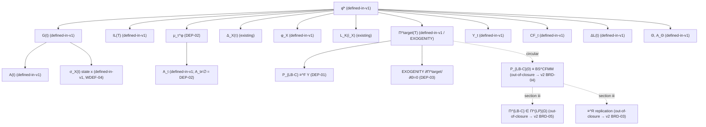

# φ̄* Dependency DAG (gate-zero, WDEF-02)

**Artifact:** transitive dependency closure of `φ̄*` (Shreve 1.7(ii) base fee).
**Status:** gate-zero — committed BEFORE any `NOTATION.md` / definition edit exists.
**Source of every file:line:** the traced closure table in
[`../../.planning/phases/00-well-definedness-dependency-dag/00-RESEARCH.md`](../../.planning/phases/00-well-definedness-dependency-dag/00-RESEARCH.md)
§"The φ* Dependency Closure (Traced)" (HIGH confidence; each row read from source).

Entry point `φ̄*` is the (ii) closed form at
[`../EXERCISES/SHREVE_EXERCISES.md`](../EXERCISES/SHREVE_EXERCISES.md):1028–1063:

```
φ̄* = [ Π^target(T) + IL(T) − Σ_{τ=t0}^T G(τ) Δ_X(τ) Σ_{i_X} L_K(i_X) μ_τ^φ(i_X,σ_X;·) Δi_X ]
      / [ Σ_{τ=t0}^T Δ_X(τ) Σ_{i_X} L_K(i_X) μ_τ^φ(i_X,σ_X;·) Δi_X ]   (well-defined iff denominator ≠ 0)
```

## Tag vocabulary (the ONLY tags used here)

- `defined-in-v1` — object gets a definition this phase.
- `defined-in-v1: existing` — primitive already defined in `BASE.md` / `CFMM_DISCRETE.md`; traversal stops here.
- `DEP-01` / `DEP-02` / `DEP-03` — a v1 proof obligation (the obligation set the rest of v1 must discharge).
- `out-of-closure` — not reachable from `φ̄*` under the EXOGENITY-bounded path; the v2 BRD reference is recorded inline.

No node carries a silent-deferral tag. A node that the bounded closure does NOT reach is tagged `out-of-closure → v2`, which is a *surfaced re-scoping finding* (see below), not a silent deferral.

## Dependency closure (tagged nested list)

Every row cites its current definition location in
[`../EXERCISES/SHREVE_EXERCISES.md`](../EXERCISES/SHREVE_EXERCISES.md) (`SHREVE`),
[`DRAFT.md`](./DRAFT.md), or
[`../IMPLIED_VOLATILITY.md`](../IMPLIED_VOLATILITY.md) /
[`../../lp-derivatives/notes/CFMM_DISCRETE.md`](../../lp-derivatives/notes/CFMM_DISCRETE.md).

- **`φ̄*`** (root, the optimal base fee) — SHREVE:1028–1063 — state: defined (explicit closed form) — tag: **`defined-in-v1`**
  - **`Π^target(T)`** target financing liability — SHREVE:742–746 (`= (1+r_f)P_{LB-C}(0) − Π^{LB-C}(T;T)`) — state: defined conditional on `P_{LB-C}(0)` — tag: **`defined-in-v1` UNDER THE EXOGENITY HYPOTHESIS** (see Re-scoping finding; the EXOGENITY assumption itself is **DEP-03**)
    - **`P_{LB-C}(t) ≡^F Υ_t`** financing identity — SHREVE:317–326, 489–497, 729–737 — state: stated, unproved — tag: **`DEP-01`**
    - **`P_{LB-C}(0) ≡ BS^{CFMM}`** (plain `≡`) — SHREVE:482; `BS^{CFMM}` def at [`DRAFT.md`](./DRAFT.md):79–84 — state: definitional / circular (`Π^{LP}(Ω)` is *defined as* "priced by `BS^{CFMM}`") — tag: **`out-of-closure → v2 (BRD-04)`** (the circular-definition trap; re-scoping finding)
  - **`IL(T)`** impermanent loss — SHREVE:382–406 — state: defined — tag: **`defined-in-v1`**
  - **`G(t)`** logistic vol/range gate — SHREVE:873–900 — state: defined — tag: **`defined-in-v1`**
    - **`A(t)`** range-imbalance gate — SHREVE:887–900 (uses `ΔX,ΔY,ΔL`) — state: defined — tag: **`defined-in-v1`**
    - **`σ_X(t)`** realized vol (**the numerical state variable `x`**) — header-only [`../IMPLIED_VOLATILITY.md`](../IMPLIED_VOLATILITY.md):19–25; body at [`../../lp-derivatives/notes/CFMM_DISCRETE.md`](../../lp-derivatives/notes/CFMM_DISCRETE.md):124–130 — state: partially-defined (body lives elsewhere) — tag: **`defined-in-v1`** (WDEF-04; body transcribed in Plan 03 and anchored to `VolatilityOracle.sol`)
  - **`Δ_X(τ)`** trade-flow increment — DGP at SHREVE:26–80; `i_X, Δ_{i_X}` imported from `CFMM_DISCRETE.md` — state: defined (existing) — tag: **`defined-in-v1: existing`**
  - **`φ_X(t,σ_X;Θ)`** fee surface — SHREVE:540–578, `=φ̄+G(t)` at :863–911 — state: defined — tag: **`defined-in-v1`**
  - **`L_K(i_X)`** liquidity distribution function (LDF) — [`DRAFT.md`](./DRAFT.md):88–119 (9 properties); `ℓ^G` at SHREVE:594–604 — state: defined — tag: **`defined-in-v1: existing`**
  - **`μ_τ^φ(i_X,σ_X;·)`** measure — SHREVE:356–366 (props) + :809–831 (closed form `μ^{(φ,G)}`) — state: partially-defined — denominator ≠ 0 / `A_t ≠ ∅` not proved — tag: **`DEP-02`**
    - **`A_t`** active set — SHREVE:824–831 — state: defined — tag: **`defined-in-v1`** (its non-emptiness `A_t ≠ ∅` IS DEP-02)
  - **`⟨L_K,μ_τ^φ⟩`, `⟨ℓ_K,μ_τ^φ⟩`** pairings — SHREVE:343–406 — state: defined — tag: **`defined-in-v1`**
  - **`Υ_t`** fee revenue — SHREVE:330–341 — state: defined — tag: **`defined-in-v1`**
  - **`CF_t = Υ_t − IL_t`** cash flow — SHREVE:370–379, 958–963 — state: defined — tag: **`defined-in-v1`**
  - **`ΔL(t)`** endogenous liquidity rule — SHREVE:606–628 — state: defined — tag: **`defined-in-v1`**
  - **`Θ`, `A_Θ`** parameter / admissible set — SHREVE:838–859 — state: defined — tag: **`defined-in-v1`**

### Out-of-(ii)-closure nodes (section iii machinery — surfaced, not silently deferred)

These are reachable only via `BS^{CFMM}` / the LP-replication theorem, which the EXOGENITY bound keeps OUT of the (ii) closure. They are recorded here for the non-circularity audit (WDEF-05, Open Question 3) and routed to v2:

- **`Π^{LB-C}(·) ∈ Π^{LP}(Ω)`** membership — SHREVE:472–476, 1083–1088 — state: unproved — tag: **`out-of-closure → v2 (BRD-05)`** (section iii)
- **`≡^R`** LP-replication theorem — SHREVE:1090–1110 — state: unproved — tag: **`out-of-closure → v2 (BRD-03)`** (section iii)

## Re-scoping finding (WDEF-02 criterion 1)

This is the load-bearing output of the DAG. The bounded path is, verbatim:

1. `φ̄*` depends on `Π^target(T)`, which depends on `P_{LB-C}(0)`.
2. The source defines `P_{LB-C}(0)` **two** ways: `≡^F Υ` (SHREVE:489–497, financing, **DEP-01**, in v1) AND `≡ BS^{CFMM}` (SHREVE:482, the circular definition where [`DRAFT.md`](./DRAFT.md):79–84 defines `Π^{LP}(Ω)` AS "priced by `BS^{CFMM}`" — a v2 **BRD-04** claim).
3. The **EXOGENITY** assumption already in the source (SHREVE:758–766, `∂Π^target(T)/∂Θ = 0`, i.e. `ΔΠ^target/ΔΘ = 0`) lets `φ̄*` treat `Π^target(T)` as an **exogenous, reviewed scalar input**.
4. Therefore the (ii) closure closes on **{DEP-01 (≡^F), DEP-02 (μ_τ^φ)}** WITHOUT pulling in `BS^{CFMM}` or the `≡^R` LP-replication machinery (section iii only).
5. The EXOGENITY hypothesis is recorded on its OWN ENUMERABLE LINE so the obligation set is auditable:
   - **DEP-03: EXOGENITY hypothesis** — `∂Π^target(T)/∂Θ = 0` (`Π^target` is an exogenous reviewed scalar input to `φ̄*`; SHREVE:758–766). This is the explicit reviewed hypothesis on the `φ̄*` statement per REQUIREMENTS DEP-03.
6. `BS^{CFMM}` (SHREVE:482; circular, BRD-04), `Π^{LB-C}(·) ∈ Π^{LP}(Ω)` membership (BRD-05), and the `≡^R` LP-replication theorem (BRD-03) are recorded **`out-of-closure → v2`** (the three out-of-closure rows above).

### Bounded obligation set (the fixed DEP-* set the rest of v1 must prove)

- **DEP-01** — the `≡^F` financing identity `P_{LB-C}(t) ≡^F Υ_t`.
- **DEP-02** — `μ_τ^φ` is a well-defined (probability) measure, i.e. `A_t ≠ ∅` so the denominator ≠ 0.
- **DEP-03** — the EXOGENITY hypothesis `∂Π^target(T)/∂Θ = 0` as the reviewed side-condition on the `φ̄*` statement.

## Resolution of Open Questions (from 00-RESEARCH.md)

- **Open Question 2** (`Π^target` tagging): resolved — tag `Π^target(T)` `defined-in-v1` *under* the EXOGENITY hypothesis, with the EXOGENITY assumption itself enumerated as **DEP-03**.
- **Open Question 3** (`≡^R` rows): resolved — the `≡^R` LP-replication and `Π^{LP}` membership rows are listed here, marked `out-of-closure → v2`, so the re-scoping decision is auditable in one place (and the WDEF-05 non-circularity table can be exhaustive over them).


